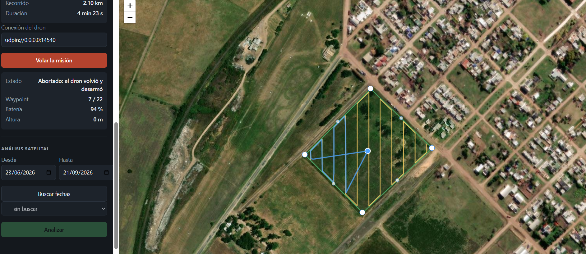
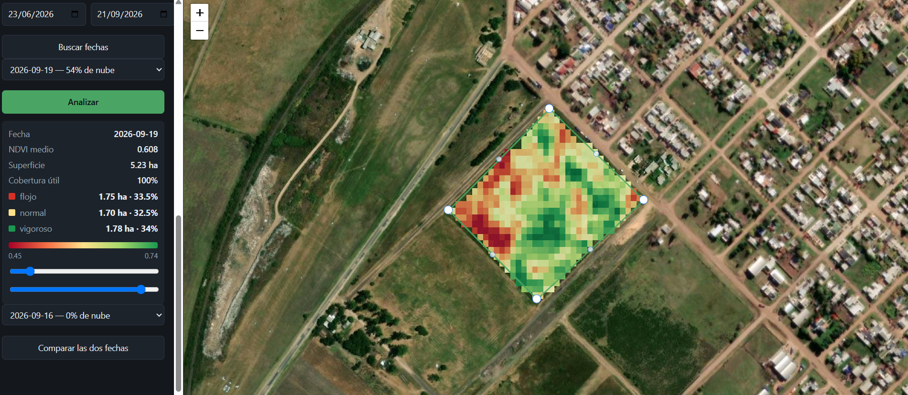
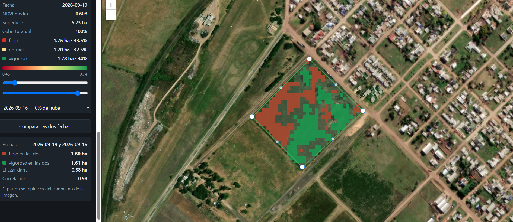

# AgroTello

Dibujás un lote sobre la foto satelital, el software calcula el recorrido que lo cubre, hace
volar el dron solo, y te dice **en hectáreas** dónde el cultivo anda flojo y dónde bien.



---

## Qué hace

**Planifica y vuela.** Del contorno del lote saca el recorrido en zigzag que lo cubre y lo
vuela de punta a punta: despega, recorre los waypoints, vuelve y aterriza. Vigila la batería
y aborta si no alcanza. Se sigue en vivo sobre el mapa y se puede cortar en cualquier
momento, con retorno automático al punto de despegue.


*El plan en amarillo, el recorrido real en azul. Acá se abortó en el waypoint 7 de 22.*

**Mide el cultivo con imágenes de Sentinel-2.** Baja únicamente el recorte del campo —33 × 33
píxeles de una escena de 120 millones—, calcula el NDVI descartando nubes y sombras, lo
recorta contra el alambrado y lo separa en zona floja, normal y vigorosa.

**Compara dos fechas** y marca solo lo que se repite en las dos, que es lo que distingue un
problema de fondo del campo de un mal día de la imagen.


*Rojo: flojo en las dos fechas. Verde: vigoroso en las dos. Al lado, cuánto daría el azar.*

## El resultado

Sobre un lote real de 5,23 ha en Gualeguaychú, con datos de 2026:

- El cultivo creció de **0,48 a 0,63** de NDVI medio entre julio y agosto.
- Hay **1,05 ha que salen flojas en dos fechas distintas**, en una mancha contigua. El azar
  daría 0,58. Eso es un sector al que ir a caminar.
- Dos pasadas del satélite separadas por tres días coinciden con **r = 0,98**: la medición
  es repetible.

## Cómo se usa

Corre sobre WSL2/Ubuntu — el simulador de PX4 no anda nativo en Windows. Ver
[`docs/sitl_setup.md`](docs/sitl_setup.md).

```bash
python3 -m venv ~/venvs/agrotello
source ~/venvs/agrotello/bin/activate
pip install -e .

python scripts/servidor.py        # http://127.0.0.1:8000
```

Para volar hace falta el simulador corriendo, o un dron PX4 del otro lado. El análisis
satelital funciona solo, sin nada más.

También se puede usar por línea de comandos, sobre los mismos archivos de lote:

```bash
python scripts/run_mission.py missions/lote_prueba.yaml
python scripts/ndvi_lote.py missions/lote_prueba.yaml --fecha 2026-08-30 --mapa
```

## Sobre el hardware

**Listo para conectarse a un dron real, pero sin probar en uno.** La capa de vuelo pasa por
una interfaz abstracta y el backend de PX4 se conecta con una cadena de texto:
`udpin://0.0.0.0:14540` apunta al simulador y `serial:///dev/ttyUSB0:57600` apuntaría a una
radio. El protocolo es el mismo; lo que el simulador no ejercita es el viento, la calidad de
GPS, la latencia del enlace y la regulación.

El análisis satelital, en cambio, no necesita hardware: mide un campo real, hoy.

## Stack

PX4 SITL + MAVSDK para el vuelo · Shapely para la geometría · Sentinel-2 vía STAC y COGs
para las imágenes · NumPy y rasterio para el análisis · FastAPI + Leaflet para la
aplicación.

## Documentación

| | |
|---|---|
| [`docs/aplicacion.md`](docs/aplicacion.md) | La pantalla, la conexión del dron y las decisiones de diseño |
| [`docs/ndvi.md`](docs/ndvi.md) | Qué mide el NDVI, sus trampas y cómo leer los resultados |
| [`docs/mission_format.md`](docs/mission_format.md) | El formato del lote y cómo elegir los parámetros |
| [`PLANNING.md`](PLANNING.md) | Arquitectura, roadmap y qué quedó fuera de alcance |

## Tests

```bash
pytest
```

93 pruebas. Ninguna necesita red, simulador ni dron.

---

Contiene información Copernicus Sentinel modificada, 2026.
